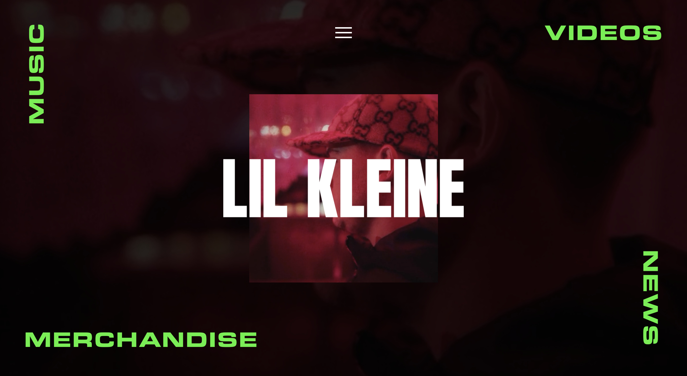
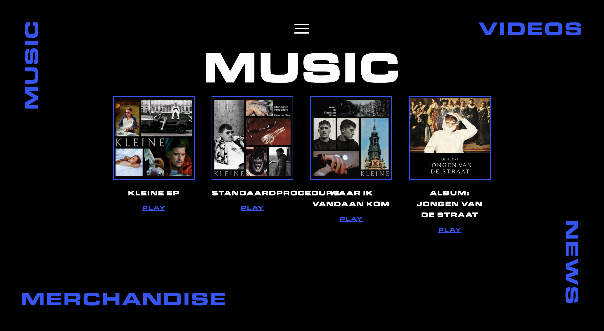
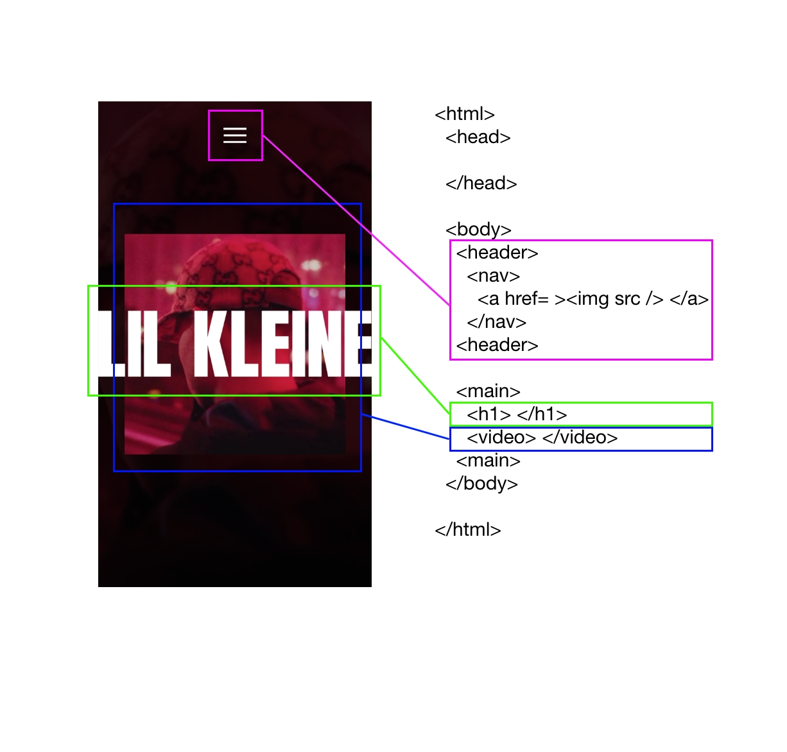
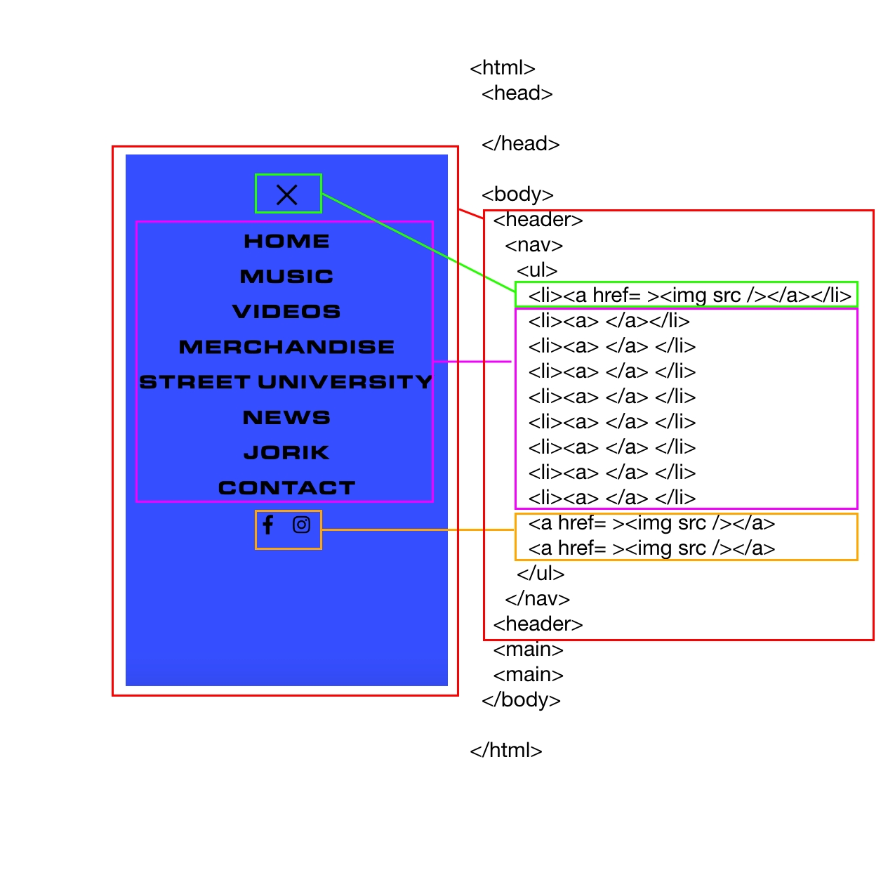
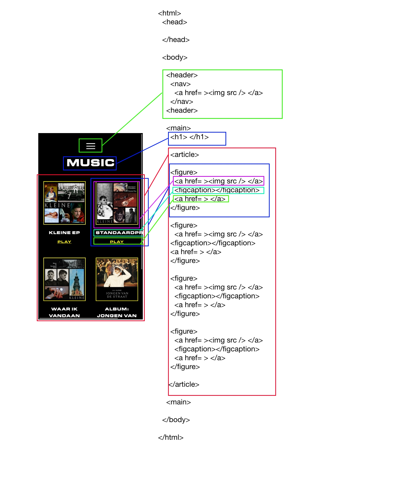
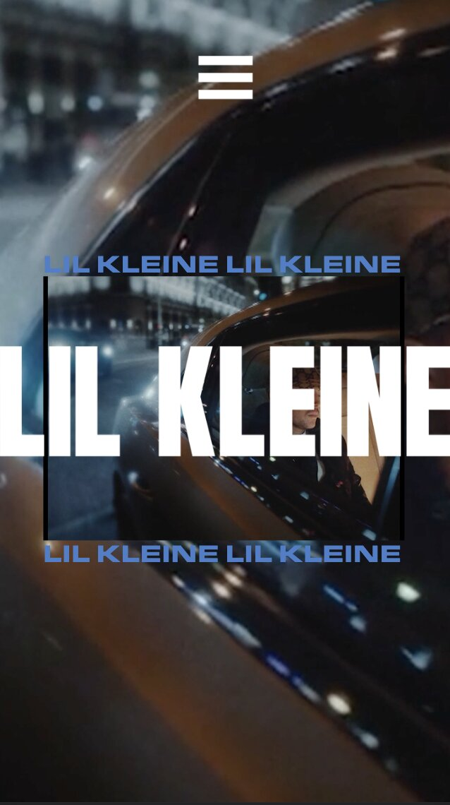
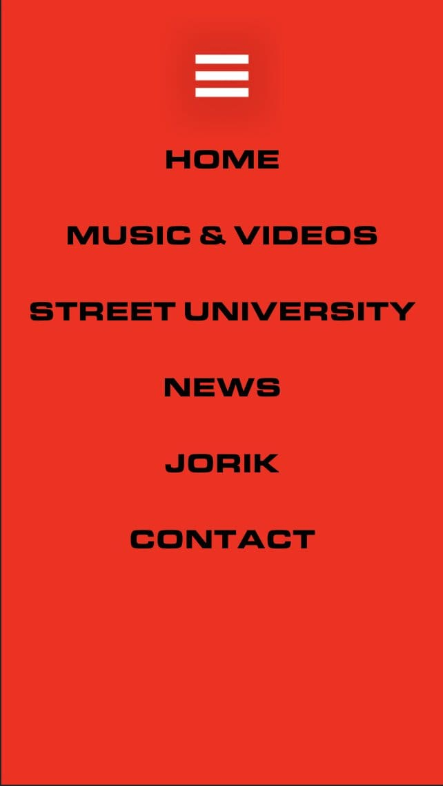
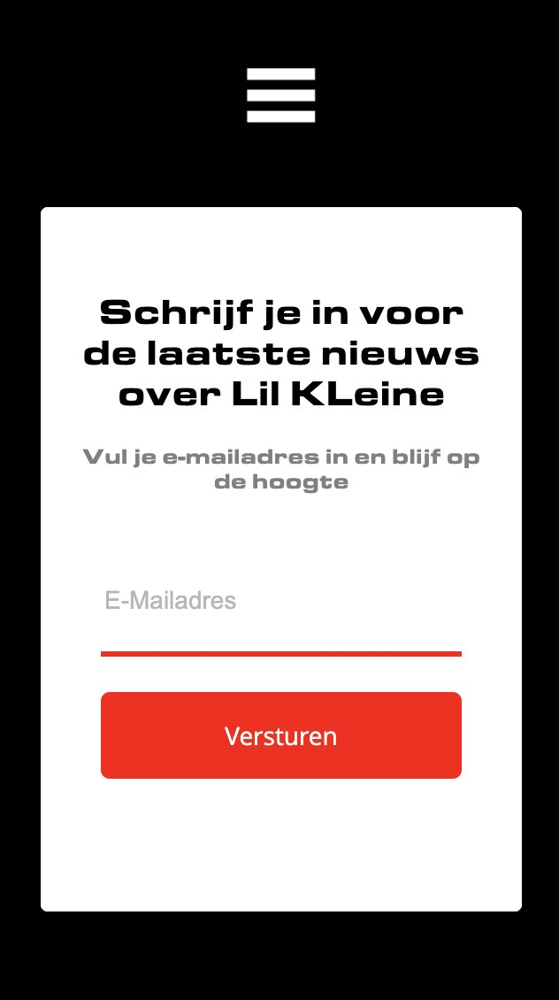

# Procesverslag
 
Markdown cheat cheet: [Hulp bij het schrijven van Markdown](https://github.com/adam-p/markdown-here/wiki/Markdown-Cheatsheet).

## Jij

uitwerken voor kick-off werkgroep

### Auteur:
Vanessa Choe

#### Je startniveau:
Blauw

#### Je focus:
Surface plane
 

## Je website

uitwerken voor kick-off werkgroep

### Je opdracht:
https://lilkleine.nl/

#### Screenshot(s) van de eerste pagina (small screen): 

Homepagina Lilkleine.nl 

Animatie Lilkleine.nl

#### Screenshot(s) van de tweede pagina (small screen):

Music pagina Lilkleine.nl 

 

## Breakdownschets (week 1)

 Uitwerken na afloop 2e werkgroep

## Voortgang 1 (week 2)

uitwerken voor 1e voortgang

### Stand van zaken
Ik ben nog niet zo ver. Ik heb alleen nog een video op de achtergrond. Met de logo van Lil Kleine. En verder wist ik ook niet hoe ik de video's op de achtergrond automatisch en gemute in mijn website moest zetten. 

### Agenda voor meeting
Hebben we nooit gedaan

### Verslag van meeting
- Studentassistent: 'Ga aan de slag.'
- Studentassistent: 'Kijk bij inspecteren wat er bij de video staat en neem dat over.'

## Voortgang 2 (week 3)

uitwerken voor 2e voortgang

### Stand van zaken
Nog steeds hetzelfde als week 2. Ik heb alleen nog een video op de achtergrond. Met de logo van Lil Kleine.

### Agenda voor meeting
hebben we nooit gedaan

### Verslag van meeting

- Robert: kijk goed naar de max-width vh's en vw's. Positioneren gaat niet helemaal goed (moet responsive zijn op mobielformaat). Structuur van je html klopt niet helemaal.

## Toegankelijkheidstest (week 4)

uitwerken na test in 8e voortgang

### 1. Contrast
Ik gebruik de kleur rood. De eerste kleur rood die ik gebruikte had een te laag contrast.

#### 2. Gele bril 
Ik had deze bril opgezet en alles was prima. De kleuren werden natuurlijk wat 'geliger' maar dit was geen last.

#### 3. Bril met vlekken 
Door de vlekken kon je af en toe moelijk de kleine zwarte woorden zien, maar dit lukte opzich nog wel goed genoeg. 

#### 4. Navigeren met de tab-toets. 
Navigeren met de tab-toets was helemaal goed gegaan. De tab-toets kon alle 'linkjes' bereiken en vervolgens activeren.

## Voortgang 3 (week 4)

uitwerken voor 3e voortgang

### Stand van zaken
Ik had de opdracht niet zo goed gelezen en dacht dat het of responsive of surface (dus dan helemaal niet responsive, maar moest dus wel op mobielformaat) zou zijn. Dus ik had al wat gepositioneerd met em's en moest dus helemaal opnieuw beginnen. Omdat ik hiervoor alleen maar met em's had gewerkt en helemaal niet met % en vw's en vh's en max/min-width, vond ik het best lastig om te gaan positioneren.

### Agenda voor meeting
hebben we nooit gedaan       

### Verslag van meeting
- Studentassistent: 'Ga je code goed ordenen, Onnodige code weghalen, dat geeft je meer overzicht om opnieuw aan de slag te gaan.'
- Studentassistent: 'Ga zo snel mogelijk aan de slag.'

## Eindgesprek (week 5)

uitwerken voor eindgesprek

### Stand van zaken

Ging goed:

1. Ik heb een soort van de elementen kunnen positioneren zoals ik wilde, maar het klopt nog steeds niet helemaal.
2. Uiteindelijk met grids werken.
3. Video's op de juiste plek in mijn website kunnen zetten.

Ging slecht: 

1. Positioneren
2. Responsive gedeelte (vooral bij de Iphone X)
3. Microinteractie met JavaScript
4. Animeren met JavaScript
5. De video responsive over de achtegrond instellen
6. Ik kwam er ook een beetje laat achter dat je met full screen moest werken bij inspecteren om je schermen per formaat goed te kunnen zien/ elementen positioneren, waardoor ik dacht dat het wel was gelukt bij het responsive scherm bij iphone X, maar dat is dus niet gelukt.

### Screenshot(s)

## Bronnenlijst

1. https://codepen.io/shooft/pen/dyRVVRr 
2. https://codepen.io/chouaibblgn45/pen/LjYvpP 
3. https://www.w3schools.com/css/tryit.asp?filename=trycss3_animation2 
4. https://www.google.com/search?q=menu+icon+white&sxsrf=AOaemvIOfsUTkNfsJPJjyGSMFWFVstVi4w:1633606281347&source=lnms&tbm=isch&sa=X&ved=2ahUKEwj5sOjQmbjzAhVPCuwKHR3eDzUQ_AUoAXoECAEQAw&biw=500&bih=711&dpr=2#imgrc=TaxjEJgSUEXn6M

